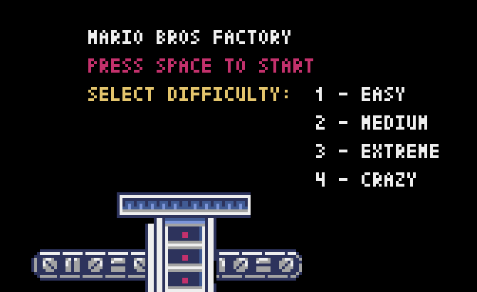
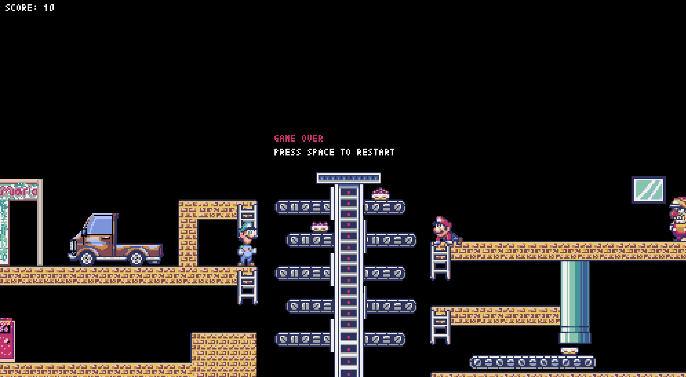
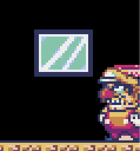
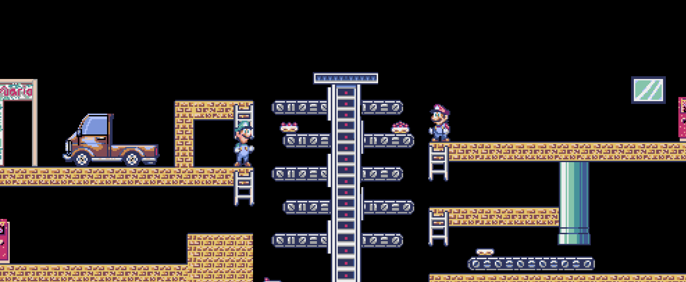

# 🎮 Mario Cross (Pyxel Edition)

Retro-inspired dual-screen arcade game built with Python and Pyxel.

## 🕹️ Game Description

Mario and Luigi move vertically across platform levels to transport cargo boxes and load them into a truck.

The game is inspired by classic 80s dual-screen handheld consoles.

## 🛠️ Tech Stack

- Python
- Pyxel
- Object-Oriented Programming
```markdown
## ▶️ How to Run

pip install pyxel  
python main.py
```
## 📸 Gameplay







